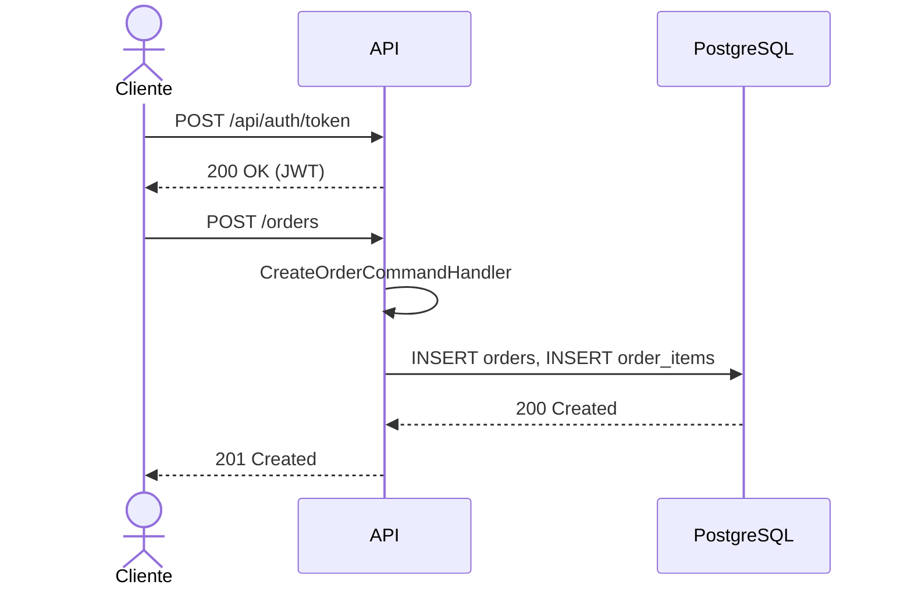
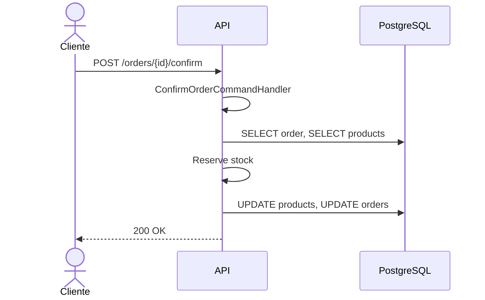
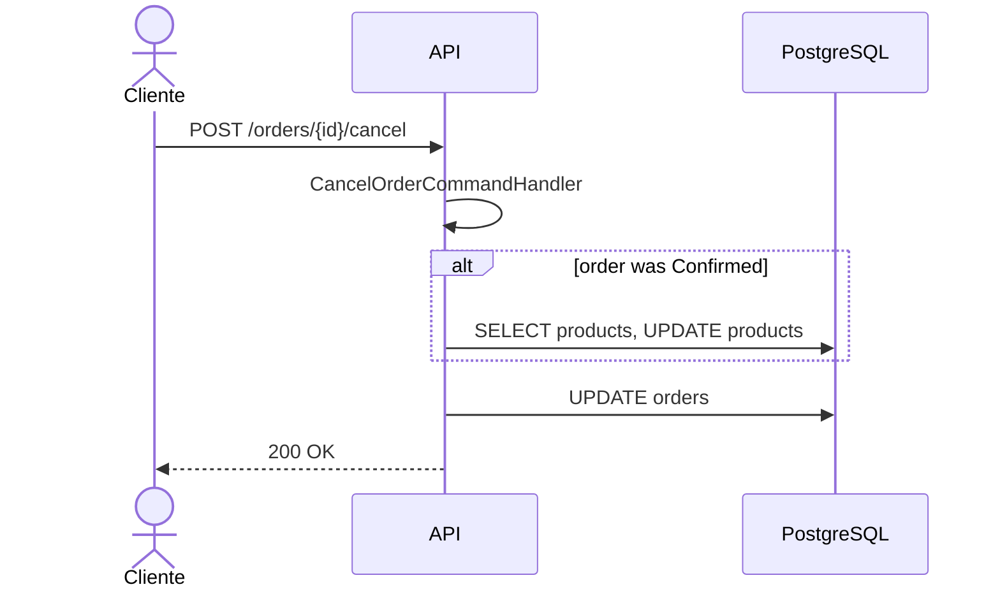

# Arquitetura do Nstech Challenge

O projeto segue uma arquitetura em camadas pensada para separar regras de negócio, casos de uso e infraestrutura.

## Visão geral

A implementação atual é centrada em um domínio de pedidos com persitência relacional em PostgreSQL. Não há broker de mensagens ativo no fluxo principal.

## Camadas

- `Nstech.Domain` — Entidades de domínio, regras de negócio e exceção de domínio.
- `Nstech.Application` — Casos de uso via comandos e queries, DTOs, interfaces de handlers.
- `Nstech.Infrastructure` — Implementação do contexto EF Core e configurações de persistência.
- `Nstech.Api` — Controllers HTTP, autenticação JWT, filtros e documentação Swagger.

### Dependências entre camadas

```
Api → Infrastructure → Application → Domain
```

- `Api` orquestra requests HTTP e compõe dependências.
- `Infrastructure` implementa abstrações de dados definidas em `Application`.
- `Application` contém a lógica de casos de uso e depende apenas de `Domain` e interfaces.
- `Domain` permanece puro e sem dependência de frameworks externos.

## Componentes principais

### Domínio

- `Order` — entidade agregada que representa um pedido.
- `OrderItem` — item associado a um pedido.
- `Product` — modelo de estoque com lógica de reserva e liberação.
- `BusinessException` — exceção de negócio uniforme.

### Aplicação

- `CreateOrderCommandHandler`
- `ConfirmOrderCommandHandler`
- `CancelOrderCommandHandler`
- `GetOrdersQueryHandler`
- DTOs: `OrderDto`, `OrderItemDto`, `OrderListDto`

### Infraestrutura

- `ApplicationDbContext` — EF Core DbContext com mapeamento das tabelas:
  - `orders`
  - `order_items`
  - `products`
- índices em `CustomerId`, `Status`, `CreatedAt`, `ProductId`.

### API

- `AuthController` — gera token JWT para credenciais de demonstração.
- `OrdersController` — expõe endpoints para criar, confirmar, cancelar e listar pedidos.
- `BusinessExceptionFilter` — converte exceções de negócio em respostas `400 Bad Request` com payload estruturado.
- Middleware de autenticação e rate limiting.

## Fluxo de criação de pedido



## Fluxo de confirmação de pedido



## Fluxo de cancelamento de pedido



## Observações importantes

- Toda a API de pedidos exige autenticação JWT.
- A implementação atual não expõe integração com mensageria ou worker separado.
- O endpoint de health check é `GET /health`.
